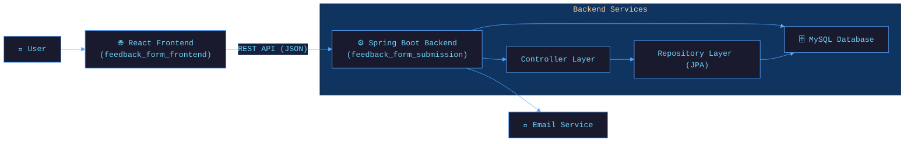

<!-- ═══════════ ANIMATED HEADER ═══════════ -->
<div align="center">
<!-- ═══════════ TYPING ANIMATION ═══════════ -->

<br/>

<!-- ═══════════ BADGES ═══════════ -->

&nbsp;

&nbsp;

&nbsp;

&nbsp;


<br/>


&nbsp;

&nbsp;


</div>

---

## 🌊 What is Feedback Submission System?

The **Feedback Submission System** is a robust, full-stack application designed to streamline the process of collecting, managing, and tracking user feedback. It features a modern, responsive React frontend coupled with a powerful Spring Boot and MySQL backend.

Whether you're managing customer queries, gathering user opinions, or tracking support tickets, this system provides a comprehensive, end-to-end solution.

> *"Listen to your users. Manage with ease. Improve continuously."*

### ✨ Core Philosophy
- 🎯 **Simplicity first** — clean and intuitive user interfaces
- ⚡ **Performance** — fast, optimized data handling with Spring Boot and Vite
- 🛡️ **Reliability** — robust data management using Spring Data JPA and MySQL

---

## 🚀 Features

<div align="center">

| Feature | Description | Status |
|---------|-------------|--------|
| 📝 **Feedback Submission** | Easy-to-use forms for users to submit feedback | ✅ Active |
| 🗂️ **Data Management** | View, organize, and paginate all submissions | ✅ Active |
| 🔍 **Search & Filtering** | Find specific feedback instantly by name or email | ✅ Active |
| 🔄 **Status Tracking** | Update submission statuses (e.g., Pending, Reviewed) | ✅ Active |
| 🗑️ **Entry Deletion** | Remove outdated or irrelevant feedback easily | ✅ Active |
| 📧 **Email Integration** | Built-in support for sending automated notifications | ✅ Active |

</div>

---

## 🛠️ Tech Stack

<div align="center">

### 🧠 Backend (Java & Spring Boot)


### 🌐 Frontend (React & Vite)


### 🔧 Tools & DevOps


</div>

---

## 🗂️ Project Structure

```
📦 FeedBack_Submission_System-main/
├── 📂 feedback_form_frontend/      ← React SPA built with Vite
│   └── 📂 feedback-app/            ← Main frontend source code
├── 📂 feedback_form_submission/    ← Spring Boot Backend
│   ├── 📂 src/main/java/           ← Java source files (Controllers, Models, Repositories)
│   ├── 📄 pom.xml                  ← Maven dependencies
│   └── ...                         
└── 📖 README.md                    ← Project documentation
```

---

## ⚙️ Architecture Overview



---

## 🚦 Quick Start

### Prerequisites

- **Java 21** or higher
- **Node.js** and **npm**
- **MySQL** Server running locally or remotely

### 🗄️ Database Setup

1. Create a MySQL database for the application (e.g., `feedback_db`).
2. Update the `application.properties` or `application.yml` in the backend to match your database credentials.

### ⚙️ Run the Backend (Spring Boot)

```bash
# 1. Navigate to the backend directory
cd feedback_form_submission

# 2. Run the application using Maven
./mvnw spring-boot:run   # Linux/macOS
mvnw.cmd spring-boot:run # Windows
```
*The backend server will start at `http://localhost:8080`*

### 🖥️ Run the Frontend (React + Vite)

```bash
# 1. Navigate to the frontend directory
cd feedback_form_frontend/feedback-app

# 2. Install dependencies
npm install

# 3. Start the development server
npm run dev
```
*The Vite frontend will typically start at `http://localhost:5173`*

---

## 🌐 API Endpoints

<div align="center">

| Method | Endpoint | Description |
|--------|----------|-------------|
| `POST` | `/feedback` | Submit a new feedback entry |
| `GET` | `/feedback` | Retrieve paginated feedback (supports `page`, `size`, `search`) |
| `PUT` | `/feedback/{id}/status` | Update the status of a specific feedback entry |
| `DELETE` | `/feedback/{id}` | Delete a specific feedback entry |

</div>

---

## 🤝 Contributing

Contributions are what make the open-source community amazing! Here's how you can help:

```bash
# 1. Fork the repository on GitHub
# 2. Create your feature branch
git checkout -b feature/AmazingFeature

# 3. Commit your changes
git commit -m '✨ Add AmazingFeature'

# 4. Push to the branch
git push origin feature/AmazingFeature

# 5. Open a Pull Request 🎉
```

---

## 📜 License

Distributed under the **MIT License**. See [`LICENSE`](LICENSE) for more information.

---

## 👨💻 Author

<div align="center">

### **Umang Pandey**
*Python Developer · Data Analyst · ML Engineer*

[](mailto:umangpandey.co@gmail.com)
&nbsp;
[](https://linkedin.com/in/umang-pandey-01b486273)
&nbsp;
[](https://github.com/Umangpandey75)
&nbsp;
[](https://umangpandey.vercel.app)

*"Query the data. Build the insight. Ship the WOW. ✨"*

</div>

---

## ⭐ Show Your Support

If **Feedback Submission System** helped you, please give it a ⭐ — it means the world!

<div align="center">

[](https://github.com/Umangpandey75/FeedBack_Submission_System-main/stargazers)
&nbsp;
[](https://github.com/Umangpandey75/FeedBack_Submission_System-main/fork)

</div>
---
<!-- ═══════════ FOOTER WAVE ═══════════ -->


<div align="center">

*Made with ❤️ by [Umang Pandey](https://github.com/Umangpandey75) · © 2026 Feedback Submission System*


</div>
